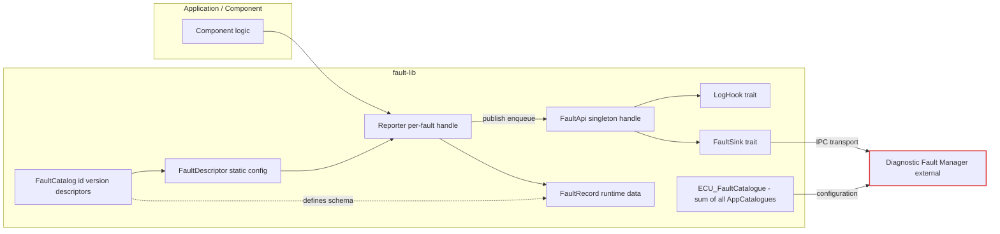
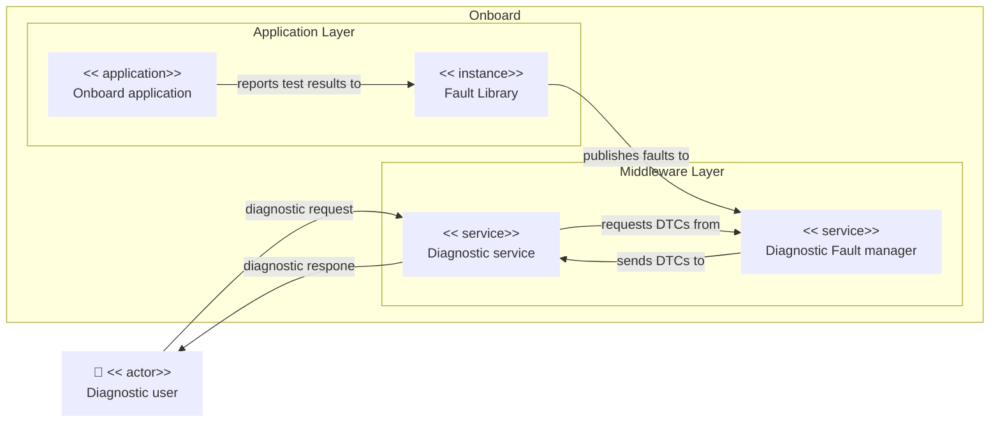
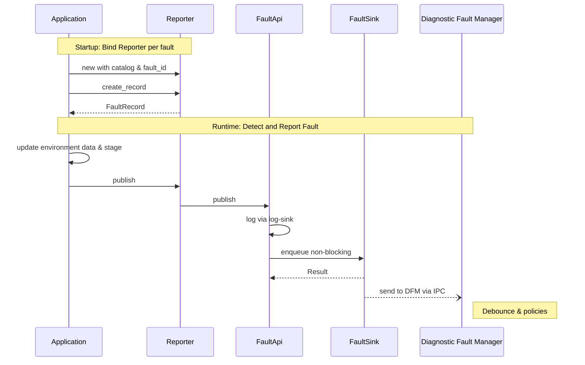

<!--
# *******************************************************************************
# Copyright (c) 2026 Contributors to the Eclipse Foundation
#
# See the NOTICE file(s) distributed with this work for additional
# information regarding copyright ownership.
#
# This program and the accompanying materials are made available under the
# terms of the Apache License Version 2.0 which is available at
# https://www.apache.org/licenses/LICENSE-2.0
#
# SPDX-FileCopyrightText: 2026 Contributors to the Eclipse Foundation
# SPDX-License-Identifier: Apache-2.0
# *******************************************************************************
-->

# Fault Library Design

The high-level design of OpenSOVD can be found here: [OpenSOVD Design](https://github.com/eclipse-opensovd/opensovd/blob/main/docs/design/design.md)

## High Level Requirements

- Provides a framework agnostic interface for apps or FEO activities to report faults - called "Fault API" in the S-CORE architecture.
- **The Fault lib is the interface between the S-CORE and the OpenSOVD project and should be developed in cooperation - see [ADR S-CORE Interface](https://github.com/eclipse-opensovd/opensovd/blob/main/docs/design/adr/001-adr-score-interface.md).**
- Relays faults via IPC to central Diagnostic Fault Manager.
- Enables domain-specific error logic (e.g. debouncing) by exposing a configuration interface.
- Reporting of test results (passed / failed) additionally enables the user to create a log entry.
- The interface needs to be specified further but will likely include:
  - Fault ID (FID)
  - time
  - ENUM fault type (like DLT ENUMs)
  - optional environment data
- Fault lib is the base for activity specific, custom fault handling.
- Can and should also be used by platform components to report faults.
- Potentially source of faults to be acted upon - e.g. by S-CORE Health and Lifecycle Management.
- Also needs to enforce regulatory requirements for certain faults - e.g. emission relevant.
- Need to include: lifecycle stages, severity analog DLT levels, aging (reset) policy (e.g. operation cycles), debounce policy (count + time based), source identifiers (entity, ecu, etc)
- Decentral component.
- The debouncing should be in the fault lib to reduce the traffic on the IPC.
- Debouncing needs to be also possible in the DFM if there is a multi-fault aggregation.
- Aging (reset) shall be done in the DFM.
- Fault caching (via enqueue) if IPC to DFM should not respond, with retry.
- Components must be able to create a fault-specific handle that binds the descriptor once and exposes simple raise/clear calls without passing the descriptor each time.

Towards DFM:

- The DFM shall handle debouncing and aging.
- The DFM shall be able to read additional environment data (snapshots) related to DTCs.
- The assignment between SOVD Entity and the Fault Source / Fault ID shall be done by the DFM. Fault semantics shall support this.

### Terminology and scope: Fault and DTCs

- Fault (HPC/App level): A granular condition observed by application or platform logic (sensor stuck, communication mismatch, etc.). Local, fast lifecycle, optimized for reporting and correlation.
- DTC (ISO 14229-1): A standardized diagnostic trouble code exposed to off-board tools and downstream workflows (service, regulatory, warranty).
- Relationship: One DTC may be synthesized from one or multiple faults (logical OR, AND, debounce convergence, escalation rules). A single fault may contribute to multiple DTCs (e.g. emission + safety categories).
- We should keep ISO 14229-1 semantics authoritative for anything that leaves the HPC/App environment.
- HPC faults are internal diagnostic signals; they are not themselves DTCs.
- The Diagnostic Fault Manager (DFM) performs mapping + status bit derivation from fault lifecycles, operation cycle,..

## Architecture Overview

Three main design goals:

1. Decentral catalogue definition
2. No need to redeploy DFM if application changes
3. Fault lib shall never block an application

### Overview

### Use-case

### Sequence

## Rust API Draft

An example can be found here: [Example Component](../examples/hvac_component_design_reference.rs)

Here's how a component ends up talking to the library:

1. Build a `FaultCatalog` using `FaultCatalogBuilder`.  The builder accepts a `FaultCatalogConfig` struct, a JSON string, or a JSON file path.  Each `FaultDescriptor` is a plain struct literal with fields for ID, name, category, severity, compliance tags, and optional debounce/reset policies.
2. Initialise the singleton `FaultApi` once via `FaultApi::new(catalog)` (or `try_new` for the fallible variant).  This creates the IPC sink to the DFM and stores the catalog in process-global state.  Optionally register a `LogHook` via `FaultApi::set_log_hook(hook)` before creating reporters.
3. Create one `Reporter` per fault ID using `Reporter::new(&fault_id, config)` (via the `ReporterApi` trait).  Each reporter looks up its descriptor in the global catalog and binds the IPC sink — callers never handle the sink directly.
4. At runtime, create a `FaultRecord` from the bound reporter: `reporter.create_record(LifecycleStage::Failed)`.  The lifecycle stage is set at creation and the timestamp is captured automatically.
5. Publish the record via the bound reporter: `reporter.publish("service/path", record)`.  This enqueues the record to the IPC sink and is non-blocking for the caller.

Each `FaultRecord` contains only runtime data (id, time, source, lifecycle_phase, lifecycle_stage, env_data). All static configuration (name, severity, compliance, debounce, reset, etc.) lives in the `FaultDescriptor` held by the `Reporter` and is not sent over IPC.

Separate traits are used for logging and fault reporting mainly due to separation of concerns (transport to DFM vs. observability (logging)).
Additional reasons include: different failure domains (IPC vs logging), different performance expectations, user-control and clarity (maybe a logging system is already used directly by the user) and cleaner mocking of transport (just mock `FaultSinkApi` trait).

## Design Decisions & Trade-offs

- **Builder-based catalogs + runtime config:** Components build `FaultCatalog` via `FaultCatalogBuilder` (from a `FaultCatalogConfig`, JSON string, or JSON file).  The DFM loads the same artifact so policy changes land via config updates instead of a rebuild.
- **Minimal runtime records:** `FaultRecord` contains only runtime-mutable data. All static configuration (descriptor, debounce, compliance, etc.) is held by the `Reporter` and not sent over IPC.
- **Explicit lifecycle states (test-centric):** `LifecycleStage` uses `NotTested`, `PreFailed`, `Failed`, `PrePassed`, `Passed` to track raw test outcomes and debounce stabilization. DTC lifecycle (pending, confirmed, aging) is not represented here; it is derived by the DFM from these stages.
- **Symmetric IPC abstraction:** The reporter side uses `FaultSinkApi` to send events; the DFM side consumes them through `DfmTransport`. Both are traits with default iceoryx2 implementations (`FaultManagerSink` / `Iceoryx2Transport`) and in-memory test doubles, so integration tests can run without shared-memory infrastructure.
- **Non-blocking publish path:** `Reporter::publish` enqueues the record to the `FaultSinkApi` and returns immediately; it does not block on DFM or transport.
- **Declarative policies:** Debounce and aging (reset) logic ride on enums (`DebounceMode`, `ResetTrigger`) to handle typical cases. Debounce variants: `CountWithinWindow { min_count, window }`, `HoldTime { duration }`, `EdgeWithCooldown { cooldown }`, `CountThreshold { min_count }`. Reset triggers: `OperationCycles { kind, min_cycles, cycle_ref }`, `StableFor(duration)`, `ToolOnly`. `cycle_ref` links the aging policy to a concrete cycle counter identity (e.g. `"ignition.main"`, `"drive.standard"`) so the DFM can correlate counts from different domains. Clarification: Debouncing can occur in Fault Lib and/or DFM (if central aggregation needed) while aging (reset) is performed in DFM.
- **Panic on missing descriptors:** If a caller asks for a fault that isn't in the catalog we `expect(...)` and crash. That flushes out drift early, so production flows should generate the catalog and component code together.

## Open Topics

Open Topics to be addressed during development:

- [ ] **Define time source for faults and fault lib.**
  - **Current state:** The library uses `std::time::SystemTime::now()` (wall-clock)
    to timestamp fault records (`reporter.rs:create_record`). The
    `duration_since(UNIX_EPOCH)` call uses `unwrap_or_default()`, which means a
    pre-epoch clock (e.g. after a severe NTP correction) silently produces
    `IpcTimestamp { seconds_since_epoch: 0, nanoseconds: 0 }` - an epoch-zero
    timestamp indistinguishable from "no timestamp".
  - **Implications:**
    - **NTP drift/jumps:** `SystemTime` is not monotonic. NTP step corrections
      can cause duplicate or out-of-order timestamps across fault records.
    - **Clock set before epoch:** The `unwrap_or_default()` fallback silently
      zeros the timestamp instead of signaling an error.
    - **Cross-ECU ordering:** Wall-clock timestamps from different ECUs are not
      comparable without a shared time synchronization protocol.
  - **Why this is an open point:** Automotive diagnostics often require monotonic
    or synchronized time bases (e.g., ECU uptime, AUTOSAR `StbM` time) to
    guarantee consistent ordering across ECUs and to survive clock corrections.
    Using `SystemTime` is sufficient for prototyping but may violate ordering
    guarantees in production.
  - **Decision needed:** Should the timestamp be (a) provided by the calling
    application, (b) sourced from a configurable `TimeProvider` trait inside
    fault-lib, or (c) a combination (library default + optional override per
    report)? The chosen approach must work across IPC boundaries (`IpcTimestamp`
    is already `#[repr(C)]` and time-source agnostic).
  - **Decision owner:** Project architect / platform team.
