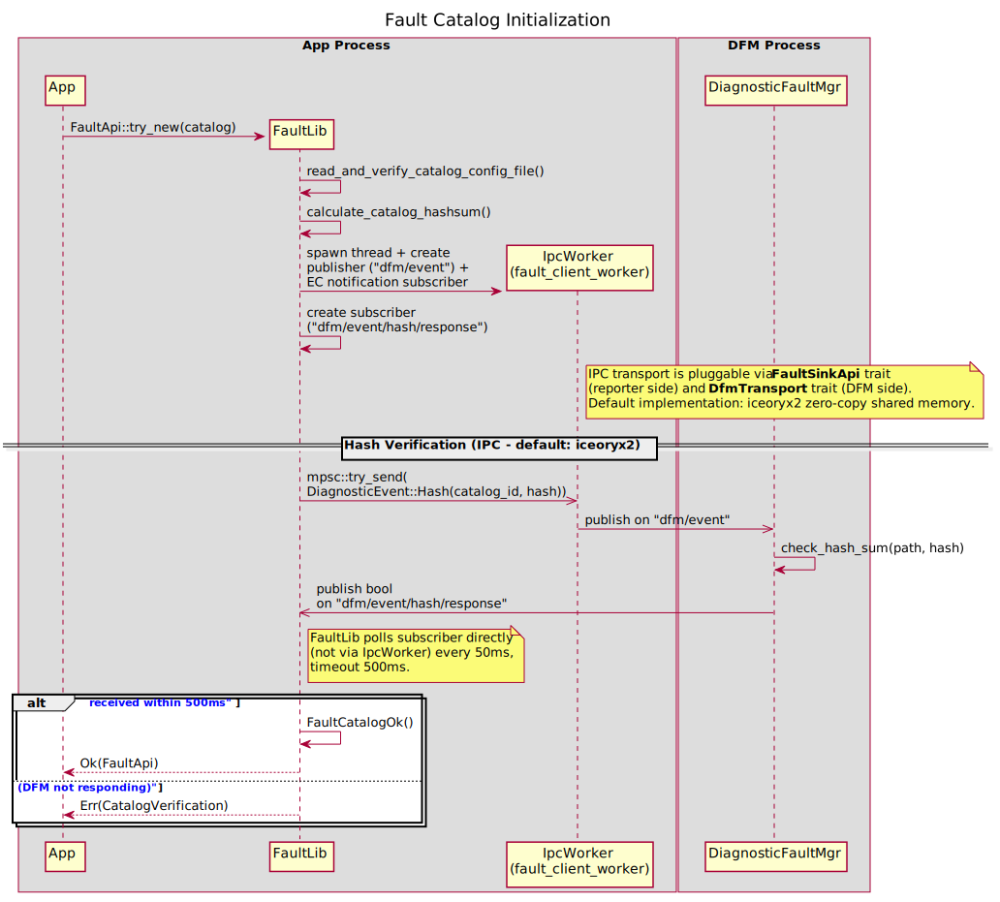
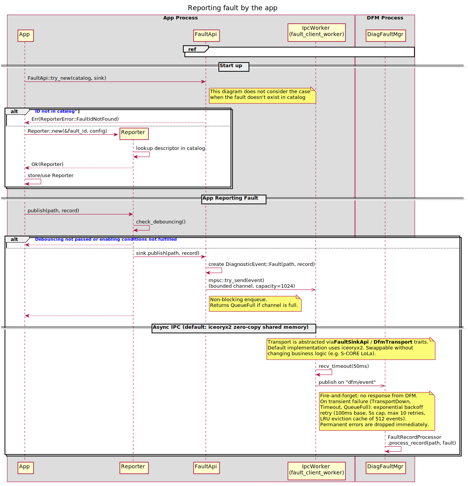
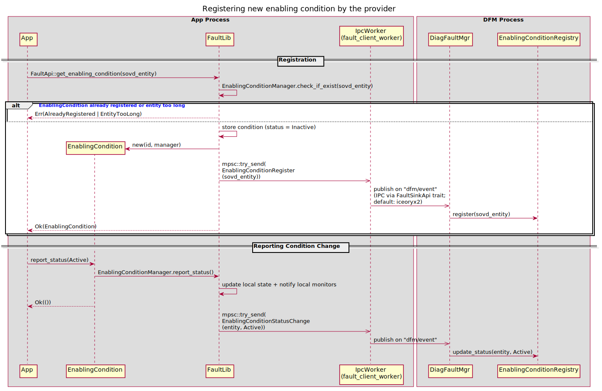
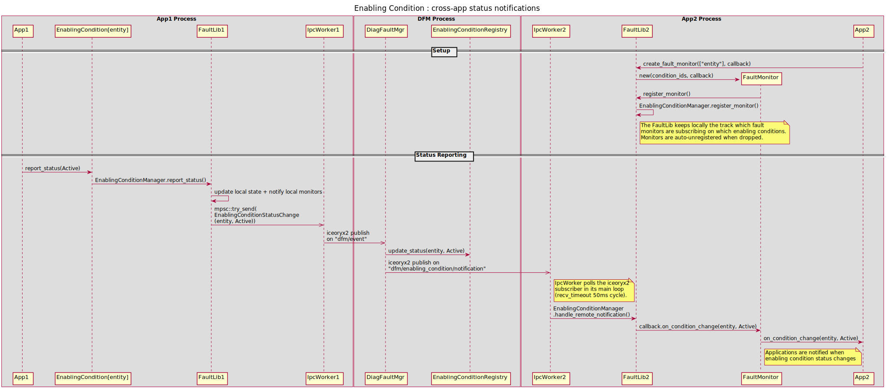
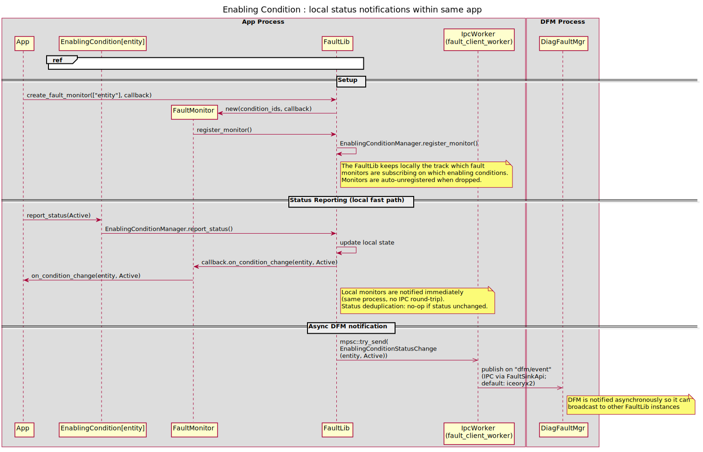

..
   # **************************************************************************
   # Copyright (c) 2026 Contributors to the Eclipse Foundation
   #
   # See the NOTICE file(s) distributed with this work for additional
   # information regarding copyright ownership.
   #
   # This program and the accompanying materials are made available under the
   # terms of the Apache License Version 2.0 which is available at
   # https://www.apache.org/licenses/LICENSE-2.0
   #
   # SPDX-License-Identifier: Apache-2.0
   # **************************************************************************

Diagnostic Fault Library  Documentation
=======================================

This documentation describes the structure, usage and configuration of the
Diagonostic Fault Library.

.. contents:: Table of Contents
   :depth: 4
   :local:

Abbreviations
-------------

+-------------+---------------------------+
| **Abbrev.** | **Meaning**               |
+=============+===========================+
| FL          | Fault Library             |
+-------------+---------------------------+
| DFM         | Diagnostic Fault Manager  |
+-------------+---------------------------+
| FOTA        | Flashing over the air     |
+-------------+---------------------------+
| IPC         | Inter Process Com.        |
+-------------+---------------------------+
| HPC         | High-Performance Computer |
+-------------+---------------------------+

Overview
--------

The diagnostic fault library should provide S-CORE applications with an API for reporting results of the diagnostic tests.
For more information on the SOVD context, see `S-CORE Diagnostic and Fault Management <https://eclipse-score.github.io/score/main/features/diagnostics/index.html>`_

Every application which is able to test health states of part or the complete HPC, it's submodules, hardware etc., needs
possibility to report results of those test back to the car environment, so the other application
or SOVD clients can access them. The Fault Library enables this possibility.

The results of the tests reported to the FaultLib are send to the Diagnostic Fault Manager which stores or update them in the Diagnostic Data Base.

.. image:: drawings/lib_arch.svg
   :alt: Fault monitor
   :width: 800px
   :align: center

Historical name mapping (pre-v0.1):

- FaultMonitor -> Reporter
- FaultMgrClient -> FaultSinkApi
- FaultApi -> FaultLib

Fault-lib and fault diagnostic manager
--------------------------------------

The fault diagnostic manager is a proxy between the apps reporting faults and the SOVD server.
Beside that it collects all faults in the system and manage persisten storage of their states.
According to the SOVD specification (chapter 4.3.1), faults can be reported by:

- SOVD Server itself
- Component
- an App

Design Decisons & Trade-offs
----------------------------

Fault Catalog
~~~~~~~~~~~~~
Despite the SOVD assumes to work with offline diagnostic services and faults catalogs (like ODX, etc.), we assume the fault_lib and DFM to share common fault catalogs.
Otherwise during the startup phase, all the fault_lib clients would need to register thousands of faults, which then would lead to heavy IPC traffic in the system.
Considering, that the presence of most of the faults in the car, doesn't change over the lifetime, it makes less sense to dynamically inform DFM about their existence by each startup.

From another hand, there will be still a subset of the faults which cannot be known during the integration of the system, or can appear and disappear depending
on the current conditions in the car (change in the features configuration, OTA, new apps downloaded to the car , etc.). For that reason the fault_lib and the
DFM shall still provide mechanism which allow the FL client to register new faults and start to reporting resuls.

.. note::
   TBD:
   Do we need a mechanism to remove from DFM a fault in case it is not tested any more ? What the SOVD standard is expecting ?

.. note::
   TBD:
   How the fault catalog shall be looks like (generated code ? , json file (probably)), and be shared between DFM and FL

Use cases
---------

Following usecases are valid for the S-CORE application using the Fault Library:

- registering new fault in the system
   - depending on car configuration variant, enabled features etc. the number of faults detected and reported by the app can change
   - depending on the current status and state of the car electronic system the APP can report different faults
- configuring debouncing for the fault
   - different test can require the results to be filtered over time or debounced, to prevent setting the faults by glitches or false positives
- configuring enabling conditions for the fault
   - each test can require different system conditions to be fulfilled before the test can be performed (e.g. the communication test can be done only if the power supply is in expected range)
- reporting results of diagnostic tests (fail / pass)
- reporting status of enabling conditions (if done in the app)
   - the application can report only status on the enabling condition and does not report any faults
- react to the SOVD Fault Handling actions (e.g. delete faults can cause the test to restart)
- react to change in the enabling conditions (some tests could be impossible to be process when enabling conditions are not fulfilled)
- provide interface to the user which allow to provide additional environmental data to be stored with the fault

Following usecases applies for the Fault Library (FL) and Diagnostic Fault Manager (DFM):

- validate the consistency of the fault catalog shared between DFM and FL
- DFM maintain global fault catalog based on the information from each FL
- FL reports state changes in the faults to DFM over IPC
- FL reports enabling condition state change to the DFM over IPC
- DFM reports over IPC to FL enabling condition state change reported by another FL
- DFM requests restart of the test for the faults reported by FL
- DFM reports cleaning of the faults in the DFM by the SOVD client
- DFM receives and maintain current status of the environment conditions to be stored together with faults

Fault Catalog Init
~~~~~~~~~~~~~~~~~~~

This sequence shall ran at each start of the system to assure the FL and DFM are using consistent definitions of the faults.

New fault in the system
~~~~~~~~~~~~~~~~~~~~~~~

New enabling condition in the system
~~~~~~~~~~~~~~~~~~~~~~~~~~~~~~~~~~~~

Enabling conditions change
~~~~~~~~~~~~~~~~~~~~~~~~~~

Local Enabling Condition
~~~~~~~~~~~~~~~~~~~~~~~~

Diagnostic Fault Manager
------------------------

Based on the above use cases, the Diagnostic Fault Manager shall:

- collect and manage the fault's enabling conditions
   - let all fault library instances to subscribe on the changes to the fault's enable conditions set
   - notify all subscribes in case the set of the active enabling conditions changes
   - let registering new enable conditions
   - receive status of enable conditions and notify all fault_lib instances using those conditions
- collect and manage states of the faults
   - handle registering of new faults in the system
   - preventing duplication of the faults
   - storing fault statuses reported by the apps
   - storing information which fault reporter awaits which enabling condition notification
- notify fault lib instances about the fault's events triggered by the SOVD diagnostic server (e.g. delete fault, disable fault, trigger etc)

MVP
---

Scope
~~~~~

The MVP shall provide following functionality and features:

- 2 test apps which can report faults to the Diagnostic Fault Manager over IPC
- in the first step no enabling conditions handling
- the fault catalog will be stored in the single json file and read by both FaultLibs and DiagnosticFaultManager
- the IPC from communication gateway shall be reused

Design
~~~~~~

FaultCatalog
^^^^^^^^^^^^

The FaultCatalog module will read, validate the catalog configuration json file and create collection of available Faults with their properties.
Later on it will calculate the hashsum over the catalog and verify if the Diagnostic Fault Manager usees the same catalog.
If not, the Diagnostic Fault Manager will copy the FaultCatalog from the FL and update local copy (TBD: shoul DFM simply share FaultCatalog with FL ?)

Fault
^^^^^

The struct containing unique ID bound to the full fault property description in the Fault Catalog. The Fault-Lib will transfer to the DFM only this ID
to inform about fault status. All other information needed by SOVD server will be read by the DFM from Fault Catalog.

Diagnostic Entity
^^^^^^^^^^^^^^^^^
Keeps the information abut the SOVD entity to which the reported fault belongs. This is open topic. Unclear how the SOVD entities shall be managed and linked to the faults.

Requirements
------------

.. stkh_req:: Example Functional Requirement
   :id: stkh_req__docgen_enabled__example
   :status: valid
   :safety: QM
   :security: YES
   :reqtype: Functional
   :rationale: Ensure documentation builds are possible for all modules

Project Layout
--------------

The module template includes the following top-level structure:

- `src/`: Main C++/Rust sources
- `tests/`: Unit and integration tests
- `examples/`: Usage examples
- `docs/`: Documentation using `docs-as-code`
- `.github/workflows/`: CI/CD pipelines

Quick Start
-----------

To build the module:

.. code-block:: bash

   bazel build //src/...

To run tests:

.. code-block:: bash

   bazel test //tests/...

Configuration
-------------

The `project_config.bzl` file defines metadata used by Bazel macros.

Example:

.. code-block:: python

   PROJECT_CONFIG = {
       "asil_level": "QM",
       "source_code": ["cpp", "rust"]
   }

This enables conditional behavior (e.g., choosing `clang-tidy` for C++ or `clippy` for Rust).
